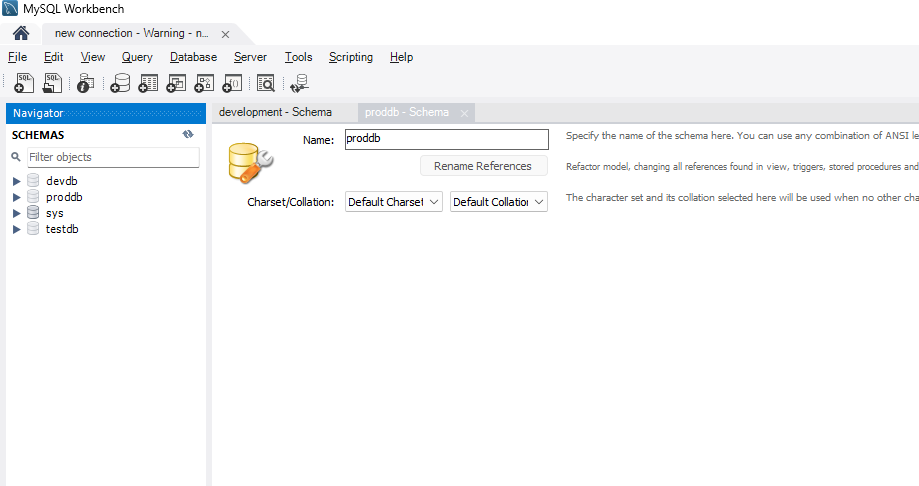
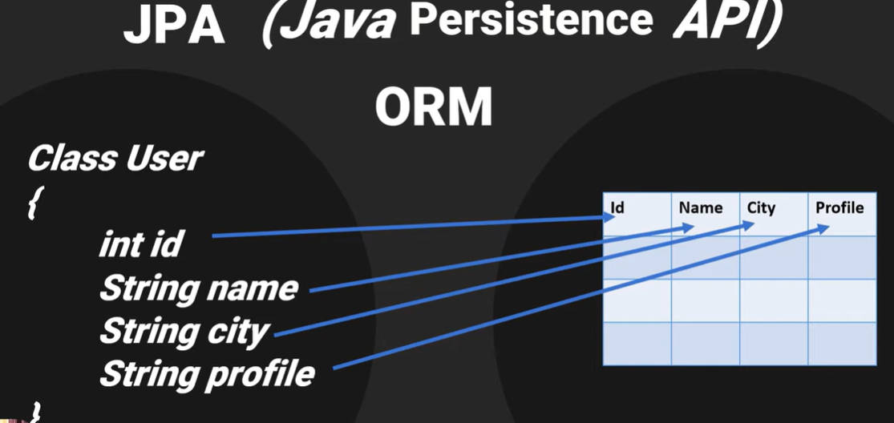
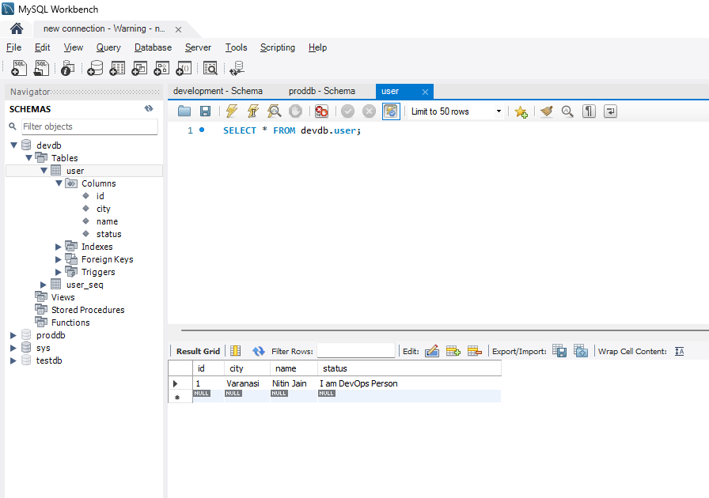

# springboot with JPA and multiple profile

- install mysql server on local
- install mysql workbench and connect to local db server
- create 3 db's - testdb, proddb, and devdb
- 
- we will now use JPA in Springboot to add and retrive data from dbs
  - JPA is Java Persistence API,
  - its an ORM (Object Relation Mapping) tool, its basically acts as third party between database and application
  - since we are dealing with java application and everything is object there so ORM will take objects from my application and store as data in database
  - Also, ORM can retrieve row from table in database and convert to object.
  - without ORM we will need to manually write query for it
  - only mapping from object to table will be done manually by us
  - 
  - JPA provides two **interfaces**
    - EntityManager
      - Create, Read, Update, Delete
    - EntityManagerFactory
    - EntityManagerFactory basically provides EntityManager
  - to use JPA in SpringBoot, we need one dependency
    - if you want to use JPA then you need to add **spring-boot-starter-data-jpa** dependency
  - we will be creating User class - its a model class or entity class
  - we need data base layer to talk with database so that we needs to create a interface(you can give any name here we use UserRepository for standard) that extends  CRUDRepository or JPARepository to get some inbuild methods from spring boot

## Practical

- added User Class for configuring database Schema
- defined properties for class
- generated getter/setter, toString method, default constructor for the class
- added interface UserRepository and extends from CRUDRepository
- its defined as generic type which accepts User Object and Integer type

### create database connection String

- added connection string in application.properties file
- added code to create user details in database directly from Spring boot application class
```text
		ApplicationContext context = SpringApplication.run(SpringMultipleprofileDemoApplication.class, args);

		UserRepository userRepository = context.getBean(UserRepository.class);

		User user = new User();

		user.setCity("Varanasi");
		user.setName("Nitin Jain");
		user.setStatus("I am DevOps Person");

		User user1 = userRepository.save(user);

		System.out.println(user1);
```

- On running the application we will see, one row added to devdb database



